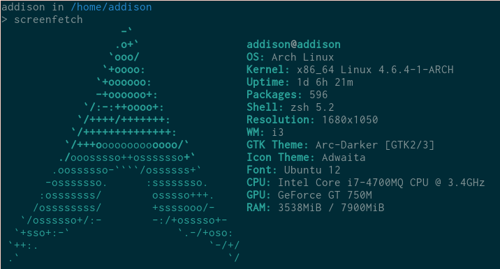

# Add Chan's dotfiles



## Installation
```bash
git clone --recursive https://github.com/addcninblue/dotfiles/
make full
```

## Vim:
For Python autocompletion:
```
pip install python-language-server
```
